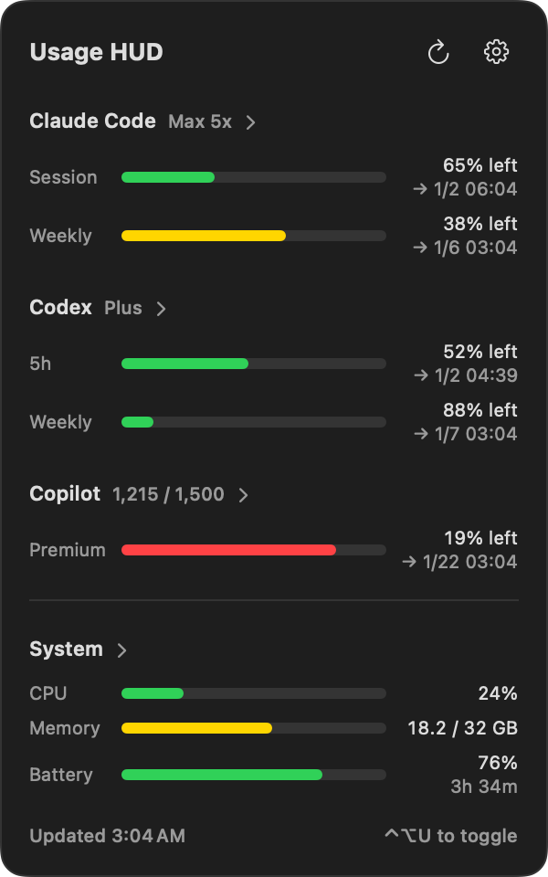

# usage-hud

[English](README.md)

[](https://github.com/Matuyuhi/usage-hud/actions/workflows/ci.yml)

Copilot / Claude Code / Codex の残り使用量と、CPU・メモリ・バッテリー・ディスク・ネットワークを一枚で見る macOS 常駐アプリ。
メニューバーにアイコンを増やさず、`⌃⌥U` で好きなときに呼び出せます。



## インストール

```sh
brew install --cask matuyuhi/tools/usage-hud
```

ソースから入れる場合:

```sh
git clone https://github.com/Matuyuhi/usage-hud.git
cd usage-hud && scripts/install.sh
```

## 使い方

- `⌃⌥U` でパネルを開閉（パネル外クリックでも閉じます）
- 各サービス名をクリックすると詳細（実クレジット数・リセット日時など）を展開
- 「System」をクリックするとメモリ内訳と、CPU・メモリの上位 5 プロセスを展開（プロセス一覧は開いている間だけ取得します）
- 歯車メニューの「表示項目」で出す項目を選択。外した項目は取得もサンプリングもしないので、使わないサービスの負荷はゼロ
- 歯車メニューから「ログイン時に起動」を設定
- 通知センターのウィジェットは「編集 → ウィジェットを追加 → Usage HUD」で追加

## 表示項目

| 項目 | 既定 | 取得元 |
|---|---|---|
| Claude Code / Codex / Copilot | 表示 | 各ツールのログイン情報（下記） |
| CPU / メモリ | 表示 | カーネル統計 |
| バッテリー | 表示 | IOKit の電源情報（内蔵バッテリーの無い Mac では非表示） |
| ディスク | 非表示 | 起動ボリュームの容量 |
| ネットワーク | 非表示 | 物理インターフェースの通信量 |

外した項目は行が消えるだけでなく、取得・サンプリング自体を行いません。
上位プロセスは `ps` から取るので CPU・メモリに従います。「System」を展開している間だけ、表示している指標のぶんだけ出ます。

## 必要なもの

使用量は各ツールのログイン情報から読み取ります。表示したいものだけログインしていれば十分です。

| 表示 | 必要なもの |
|---|---|
| Claude Code | Claude Code でログイン済みであること |
| Codex | `codex` CLI でログイン済みであること |
| Copilot | `gh auth login` 済みであること |

いずれも読み取りのみで、認証情報の書き換えや更新は行いません。

## 表示言語

UI はシステムの言語設定に従い、英語と日本語を収録しています。
どちらかに固定する場合は「システム設定 > 一般 > 言語と地域 > アプリケーション」で指定してください。

## 注意

各サービスの使用量 API は公開仕様ではないため、提供側の変更で取得できなくなることがあります。
取得に失敗したサービスは、直前の値とエラー内容を並べて表示します。

## 開発

```sh
scripts/install.sh            # Release ビルドして /Applications に入れる
scripts/check-invariants.sh   # CI が見る署名・sandbox・認証まわりの決めごとチェック
scripts/bump-version.sh patch # VERSION と xcodeproj のバージョンをまとめて上げる
```

PR ではこの 2 つが回る（macOS での universal Release ビルドと、上の invariant チェック）。
リリースは `VERSION` が信号なので、「Bump version」ワークフローを回して、開いた PR をマージすると
リリース公開と Homebrew cask 更新まで進む。bump では xcodeproj の `MARKETING_VERSION` /
`CURRENT_PROJECT_VERSION` も一緒に上がるので、ローカルに入れたビルドもリリースと同じバージョンを名乗る。

## ライセンス

MIT
